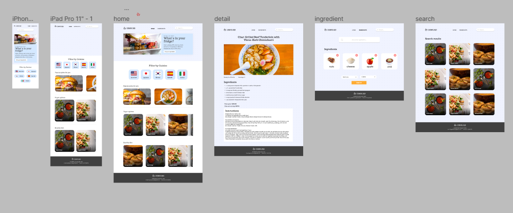
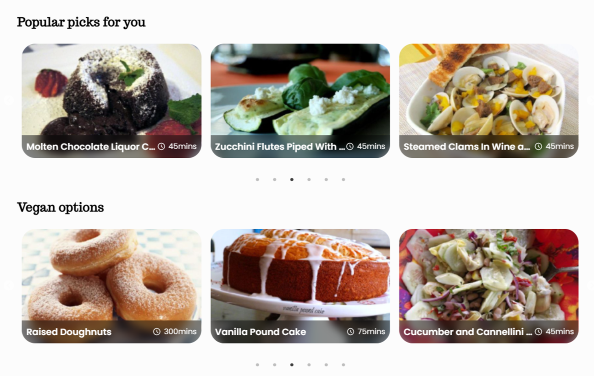

# **
CookingBud
**
**
A recipe app using React and spoonacular API
**
**<a href='https://cookingbud.netlify.app' align='center' style='display: block' >Live site</a>**

### **Built with**
- React
- CSS module
- Slick (library for slider)
- Motion Framer

### **How it started**

It's been about a month since I first started learning React at this point and I wanted to do a project on my own. One day, I was browsing online when I came across an article with a bunch of APIs for developers to try out. Spoonacular Recipe API in particular had most of my attentions so I started designing in figma right away.

### **Idea**

I wanted to make a recipe app where user's can choose only the ingredients they have and it's give out the recipes with all these selected ingredients. Initially, that was all I planned, but it wasn't really enough for me to practice working with APIs. So I also added random popular recipes and vegan recipes that refresh every 12 hours (due to limited request), a `search functionality` and a `filter by cuisine` functionality.

### **Design process**

I've been getting into the UI/UX fields lately and I came up with a simple but accessible (hopefully) design for the app.

### **Coding process**

I did all pages with the `mobile-first` workflow. The styling was simple and I tried to refactor code as much as possible and followed the rule of `don't repeat yourself`. I had some hard time dealing with errors and stuffs when fetching data. Since I was ot using axios, I had to manually set the error display appropriately. I also used some custom hooks for fetching data, and checking for current screen size. I also did have a custom hook for dealing with `localStorage` but it sort of became pointless so I had to get rid of it. I instead made a new component and got a much cleaner code.

### **Some features I'm glad I added**

So I can't affod to fetch for random popular, vegan recipes everytime someone enters or refreshes the page. So I instead only fetched once and store it in `localStorage`. I wasn't sure how I was gonna deal with it later on but I eventually came up with also storing a time in `localStorage` every 12 hours or more, it re-fetches again.

For selecting ingredients, at first, I wasn't sure how I was gonna come up with searching and selecting the ingredients. Luckily the API had a autocomplete endpoint which I used to implment that exact thing.

### **Features I wish to add in the future**

I'm now learning Redux and I'd probably redo this project with Redux and more new stuffs in the future. Or maybe not. Also when I was designing, I forgot to add the bookmark feature. It would've been way better if I added that and I'll probably come back for it in the future as well